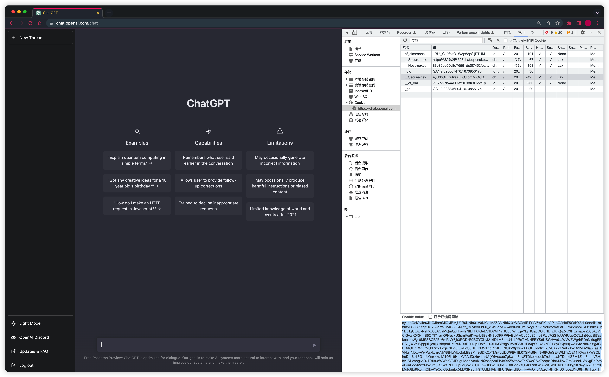
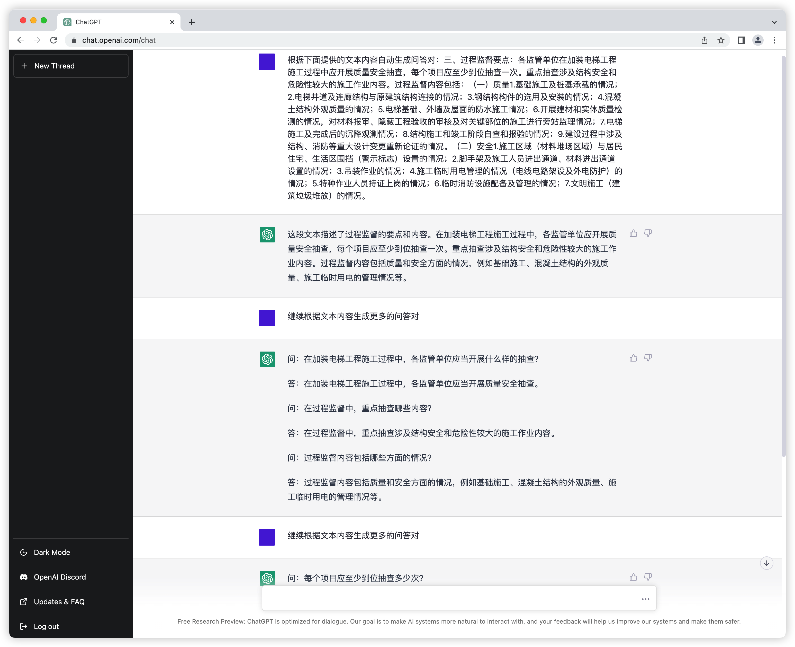

# 基于ChatGPT的问答对自动生成

> 通过调用 OpenAI 的 ChatGPT 网页接口来获取响应的内容

# 项目结构

```
tree

.
|-- LICENSE                 # 开源协议
|-- README.md               # 说明文档
|-- main.py                 # 启动脚本
|-- data                    # 数据目录
|   |-- gen_data            # 生成后的文档存储位置
|   `-- raw_data            # 原始数据文件
`-- requertments.txt        # 环境依赖文件

3 directories, 4 files
```

# 环境准备

```
selenium
undetected-chromedriver>=3.1.7
PyVirtualDisplay>=3.0
markdownify>=0.11.6
pyChatGPT>=v0.3.8
```

克隆项目后切换路径至项目路径下，执行 `pip install -r requertments.txt` 即可安装相关依赖

> ps: 可以直接通过 github 仓库下载相关源码进行安装。chrome浏览器版本可能需要更新至最新版


# 数据准备

将需要生成问答对的文本存放在 `data/raw_data` 下方，确保文本中每行为一条需要生成问答对的文本

样例如下:

> `data/raw_data/sample.txt`

```
问题生成（Question Generation）是文本生成中的重要子任务，旨在根据输入数据（文本、知识库、图像等类型，本文仅聚焦文本类型）生成与输入相关且自然流畅的问题。由于机器阅读理解（Machine Reading Comprehension, MRC）和智能问答系统的蓬勃发展，问题生成受到了越来越广泛的关注。
面向多样性的评价指标在以对话为代表的 NLG 任务上得到了广泛的研究，然而多样性的定义依旧不够具体，如何衡量、促进甚至控制生成文本不同方面的多样性也是一个值得关注的研究方向。
```

# 代码说明

`pyChatGPT` 使用方法:

```python
from pyChatGPT import ChatGPT

session_token = 'abc123'  # `__Secure-next-auth.session-token` cookie from https://chat.openai.com/chat
api1 = ChatGPT(session_token)  # auth with session token
api2 = ChatGPT(session_token, proxy='http://127.0.0.1:7890')  # specify proxy
api3 = ChatGPT(auth_type='google', email='example@gmail.com', password='password') # auth with google login
api4 = ChatGPT(session_token, verbose=True)  # verbose mode (print debug messages)

resp = api1.send_message('Hello, world!')
print(resp['message'])

api1.reset_conversation()  # reset the conversation
api1.close()  # close the session
```


项目主要代码:

```python
······

def get_response(query):
    try:
        response = chat.send_message(query)
        return response["message"]
    except ValueError:
        logger.error(traceback.format_exc())
        return ""

query = f"根据下面提供的文本内容自动生成问答对：{line}"
logger.info(query)

response = get_response(query)
logger.info(response)

for i in range(3):
    response = get_response("继续根据文本内容生成更多的问答对")
    logger.info(response)

······
```


在 `main.py` 中修改第87行的 `session_token` ，替换为你自己的即可。如果需要开启代理的话，把代理地址也换成你的。


获取 `session_token` 的方法:

1. 使用 Chrome 访问 `https://chat.openai.com/chat`, 登陆后按 `F12` 进入开发者界面
2. 依次点击: `Application` > `Storage` > `Cookies` > `https://chat.openai.com` , 查找 `__Secure-next-auth.session-token`
3. 复制 `Cookie Value` 字段的值

</img>

# 启动方式

`python main.py`

运行完成后的问答对在 `data/gen_data` 下方，也可以通过日志文件 `logs/chatgpt.log` 查找请求的文本内容及响应的文本，处理后即可得到 `ChatGPT` 生成的问答对。

# 结果展示

</img>
